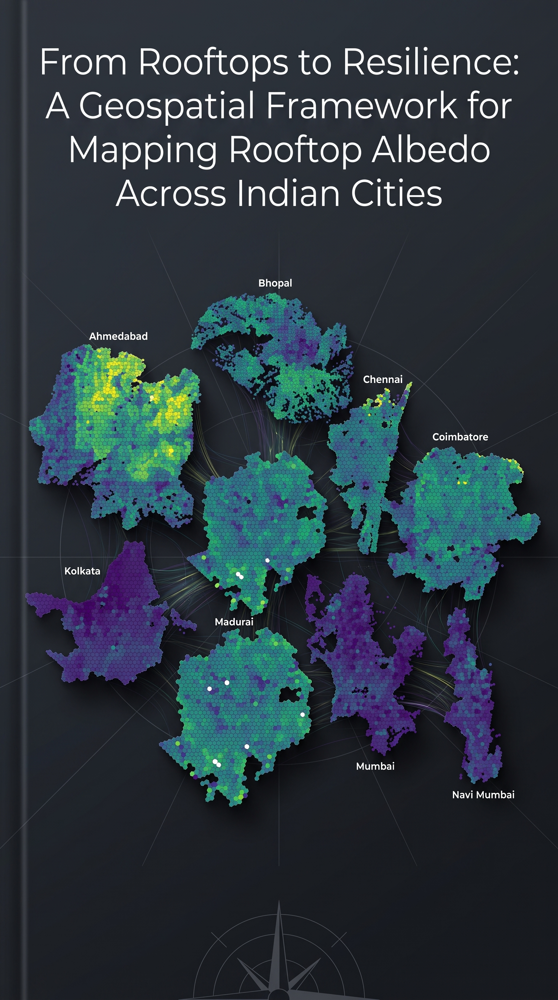
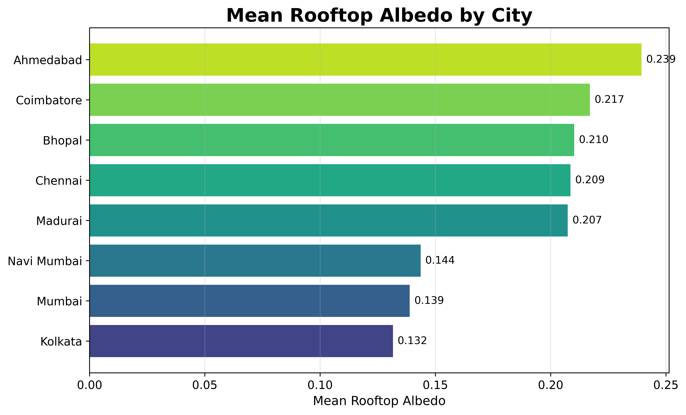
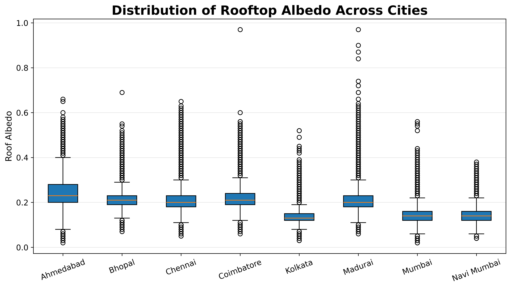

# From Rooftops to Resilience
## A Reproducible Geospatial Framework for Mapping Rooftop Albedo Across Indian Cities

<p align="center">

</p>

---

## Overview

Urban rooftops are an underutilized component of the built environment with the potential to contribute to climate adaptation, urban heat mitigation, and future distributed renewable energy systems. Understanding rooftop surface characteristics is therefore an important first step toward evidence-based urban sustainability planning.

This repository presents a **reproducible geospatial workflow** for analyzing rooftop albedo across **eight major Indian cities** using **Google's Heat Resilience Rooftop Albedo Dataset**, OpenStreetMap administrative boundaries, and H3 hierarchical spatial indexing.

Rather than estimating rooftop solar potential directly, this project develops a standardized analytical framework for processing, visualizing, and comparing rooftop reflectivity across diverse urban environments using entirely open-source geospatial tools.

---

## Research Motivation

India's clean energy transition is rapidly expanding. However, increasing deployment of utility-scale renewable energy infrastructure has also raised important questions regarding agricultural land conversion, ecological conservation, and community livelihoods.

This project explores a complementary perspective:

> **How can existing urban rooftops contribute to climate resilience and support future distributed renewable energy systems?**

While this study **does not estimate rooftop photovoltaic potential**, it establishes a reproducible geospatial framework that can serve as a foundation for future research integrating rooftop geometry, solar irradiance, land surface temperature, and urban morphology.

---

## Study Area

Eight major Indian cities representing diverse climatic conditions and urban morphologies were analyzed:

- Ahmedabad
- Bhopal
- Chennai
- Coimbatore
- Kolkata
- Madurai
- Mumbai
- Navi Mumbai

---

## Dataset

This project utilizes Google's **Heat Resilience Rooftop Albedo Dataset**.

**Dataset Characteristics**

| Attribute | Value |
|------------|-------|
| Dataset | Google Heat Resilience |
| Observations | 3.34 Million Rooftops |
| Variables | Mean Albedo, Latitude, Longitude |
| Spatial Reference | EPSG:4326 |

Administrative boundaries were obtained using **OpenStreetMap** through the **OSMnx** Python package.

> Due to GitHub file size limitations, the original dataset is **not included** in this repository. Please refer to the **data/** directory for download instructions.

---

# Methodology

The workflow follows six major stages.

```text
Google Heat Resilience Dataset
              │
              ▼
      Data Quality Assessment
              │
              ▼
      Geospatial Processing
              │
              ▼
 OpenStreetMap City Boundaries
              │
              ▼
        Spatial Clipping
              │
              ▼
      H3 Spatial Aggregation
              │
              ▼
     Statistical Analysis
              │
              ▼
 Publication-quality Maps & Figures
```

---

## Repository Structure

```
india-rooftop-albedo-analysis
│
├── notebook/
│   └── Rooftop_Albedo_Analysis.ipynb
│
├── report/
│   └── From_Rooftops_to_Resilience.pdf
│
├── figures/
│   ├── Figure_01.png
│   ├── Figure_02.png
│   ├── Figure_03.png
│   ├── Figure_04.png
│   └── cover.png
│
│
├── data/
│   └── README.md
│
│
└── README.md
```

---

# Key Results

The developed workflow successfully processed over **3.34 million rooftop observations** into standardized H3 spatial products across eight Indian cities.

### Major Findings

- Processed **3.34 million rooftop observations** using Google's Heat Resilience dataset.
- Successfully generated H3-based spatial representations for all study cities.
- Ahmedabad exhibited the highest mean rooftop albedo (**0.239**).
- Kolkata recorded the lowest mean rooftop albedo (**0.132**).
- More than **95%** of rooftops in Mumbai and **98%** in Kolkata fall within the low-albedo category (<0.20).
- H3 aggregation revealed substantial neighborhood-scale variability that cannot be captured using city-wide averages alone.
- The complete workflow is fully reproducible using open-source Python libraries.

---

# Figures

## Spatial Distribution of Rooftop Albedo

<p align="center">

</p>

The H3 spatial aggregation reveals considerable spatial heterogeneity both within and among Indian cities, emphasizing the importance of neighborhood-scale analysis.

---

## Comparative Rooftop Albedo Ranking

<p align="center">

</p>

Ahmedabad exhibited the highest average rooftop albedo, whereas Kolkata recorded the lowest.

---

## Distribution of Rooftop Albedo

<p align="center">

</p>

Boxplots illustrate substantial differences in rooftop reflectivity distributions among the selected cities.

---

## Rooftop Albedo Histograms

<p align="center">

</p>

Frequency distributions reveal considerable diversity in rooftop surface characteristics across India's urban environments.

---

# Technologies

- Python
- GeoPandas
- Pandas
- NumPy
- Matplotlib
- OSMnx
- H3
- Shapely
- Google Colab

---

# Future Work

This framework establishes a foundation for future research integrating:

- Rooftop photovoltaic potential
- Land Surface Temperature
- Urban Heat Island assessment
- Building footprints
- Population density
- Urban energy demand
- Climate-resilient city planning
- Distributed renewable energy systems

---

# Acknowledgements

This project builds upon the availability of open geospatial datasets and open-source scientific software that make reproducible urban climate research possible.

Special thanks to **Milan Janosov** for openly sharing his rooftop albedo workflow and methodology through his article and accompanying notebook. His work provided valuable methodological guidance for processing and visualizing Google's Heat Resilience rooftop albedo dataset. This project adapts and extends those concepts to develop a reproducible comparative framework for Indian cities using H3 spatial indexing and open-source geospatial tools.

I also acknowledge **Google Research**, **OpenStreetMap**, and the broader open-source geospatial community for providing the tools and datasets that made this work possible.

---

# Citation

If you use this repository, please cite:

**Mirashi, J. (2026). _From Rooftops to Resilience: A Reproducible Geospatial Framework for Mapping Rooftop Albedo Across Indian Cities._**
